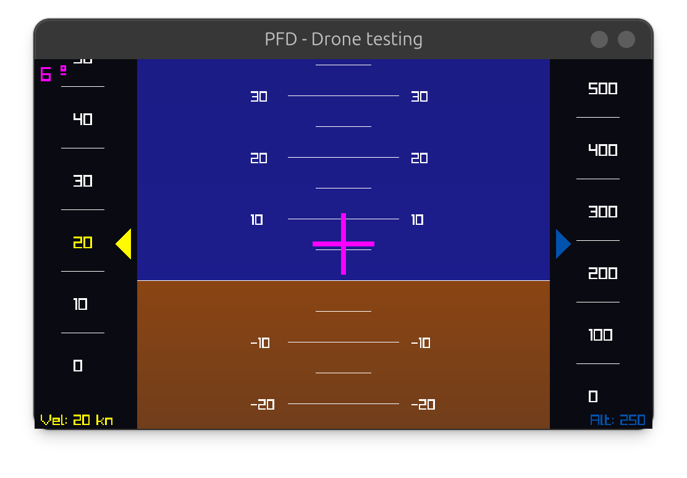

# Primary Flight Display (PFD) for Drone Telemetry

## Overview

This project implements a **Primary Flight Display (PFD)**, a key instrument typically used in aircraft to show critical flight data such as attitude, airspeed, altitude, and heading. The PFD will be adapted for **drone telemetry visualization** and integrated into a **ROS (Robot Operating System)** environment.

**Note**: This project is currently under active **development**. Features are being continuously updated, and the full functionality is in progress.




## Features

- Artificial horizon (attitude indicator)
- Altimeter
- Airspeed indicator
- Heading display
- Real-time telemetry visualization

## Purpose

This PFD is designed to assist drone operators by providing a familiar and intuitive display of flight telemetry. It serves as a visualization tool for monitoring the state of the drone in real-time, especially during autonomous or remotely piloted missions.

As the project is still under development, some features may be subject to changes, and updates will be released in future versions.

## How to Execute

1. **Make the script executable**:

   ```bash
   chmod +x run.sh
   ```

   <br>

2. **Run the script**:

   ```bash
   ./run.sh [--w WIDTH] [--h HEIGHT] [--theme THEME]
    ```

   - Default parameters: `--w 1000 --h 600 --theme light`
   - Example: `./run.sh --w 1200 --h 800 --theme dark`

## Controls

To test the component, the following controls are used to adjust various parameters:

- **W, S**: Increase or decrease the **attitude**.
- **U, J**: Increase or decrease the **speed**.
- **I, K**: Increase or decrease the **altitude**.

## References

- [Primary Flight Display – Wikipedia](https://en.wikipedia.org/wiki/Primary_flight_display)
